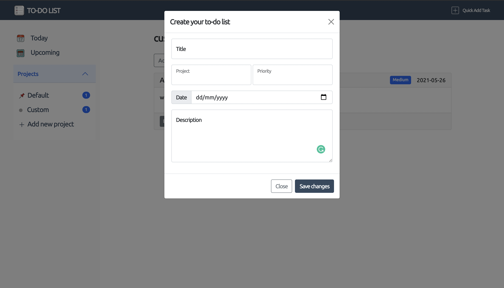

## To-do List

## Live Link
Visit the [To-do List]() to get started

### Objectives:
- Functional programming
- Principles of Object-oriented design
- Code organization with ES6 modules in Javascript
- Using Webpack for compiling Javascript modules
- DOM manipulation
## Features

> The todo list application organizes a user's tasks in items and projects. To create a todo list, click 
on the `Add task` button or the `Quick Add Task` in the navigation bar. The task is created by filling 
the input fields in the modal that appears. On first visit, users' tasks are saved to a default project. 
Users can however create new projects from the sidebar. The modal provides options to assign tasks to a project. 
All tasks and projects are stored in Local Storage.

## Prerequisites
- Internet Connection
- Git GUI
- An Integrated Development Environment
- Chrome and Firefox. Partial support is available on Safari. Internet Explorer is not supported.
- Node Package Manager [(NPM)](https://docs.npmjs.com/about-npm)

## Tools/Built With
- JavaScript ES6
- Webpack
- Bootstrap
- HTML5/CSS3
- NPM

## Getting Started
- To get started with the app, clone this project by running `git clone https://github.com/george-swift/todo-list.git`
- Run `npm install` to install the needed packages and dependencies
- Open the directory in your preferred IDE to view source files
- Development tools are included in the npm script. Run `npm run watch` and fire up a local server to view any dev changes.
- To terminate the server, enter `Ctrl + C` in your terminal

## Authors

👤 &nbsp; **Ubong George**
- LinkedIn: [Ubong George](https://www.linkedin.com/in/ubong-itok)
- Twitter: [@\_\_pragmaticdev](https://twitter.com/__pragmaticdev)
- GitHub: [@george-swift](https://github.com/george-swift)

👤 Yusif Badmus

- GitHub: [@ybadmus](https://github.com/ybadmus) 
- LinkedIn: [LinkedIn](https://www.linkedin.com/in/ybadmus/)
- Twitter: [@yusif_badmus](https://twitter.com/yusif_badmus)

## Acknowledgments

- [Microverse](https://www.microverse.org)
- [Odin Project](https://www.theodinproject.com/paths/full-stack-javascript/courses/javascript/lessons/todo-list)

## Show your support

Leave a :star:️ &nbsp; if you like this project!

## License

Available as open source under the terms of the [MIT License](https://opensource.org/licenses/MIT).